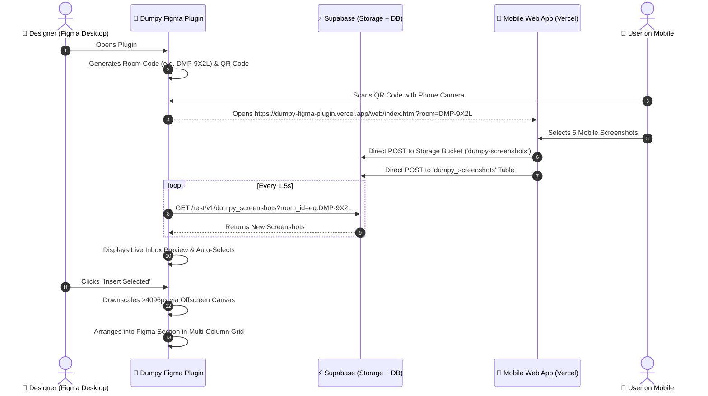

# 📱 Dumpy — Real-Time Screenshot Inbox for Figma

> **Production-grade, zero-build Figma plugin & Vercel mobile web app powered by Supabase.**  
> Snap screenshots on your phone and beam them directly into organized Figma sections with live 1.5s polling.

---

## ⚡ Key Features

- **Zero `node_modules` / Zero Build Tools**: Pure vanilla HTML, CSS, JavaScript (ES6+), and `manifest.json`. Instantly approved on Figma Community and zero compilation lag.
- **DM Sans & Crisp SVG Vectors**: Clean, modern typography via Google Font "DM Sans" and pure inline vector icons (no emojis).
- **Instant Device Pairing**: Opens immediately with an interactive, offline-generated QR code for your private room (`DMP-XXXX`). No friction or blocking login screens.
- **1.5s Live Inbox Polling**: Sub-second delta polling against Supabase REST API with instant notifications on new screenshot arrivals.
- **Section Organizer**: Automatically detects existing Figma `SectionNode`s or creates organized new sections (e.g. `Mobile Screenshots (DMP-8K2N)`).
- **Smart 4096px Downscaling**: Uses an offscreen HTML `<canvas>` to proportionally downscale ultra-high-resolution mobile captures (48MP/100MP) to 4096px, preventing Figma canvas texture crashes.
- **Batch Grid Layout Engine**: Places 1 or 50 screenshots in a balanced, multi-column grid with aspect ratio preservation and drop shadows in one click.
- **Direct-to-Storage Mobile Uploader**: Mobile web app uploads straight to Supabase Storage via native browser `fetch()` and records metadata into Postgres.

---

## 📂 Project Structure

```text
Dumpy-Plugin/
├── manifest.json         # Figma Plugin Manifest (v1.0.0, zero-dependency)
├── code.js               # Figma Sandbox Backend (Sections, Images, Grids)
├── ui.html               # Figma Plugin UI (Inlined DM Sans, QR Engine, Poller)
├── supabase_schema.sql   # Complete Supabase Database & Storage Setup SQL
├── vercel.json           # 1-Click Vercel Static Deployment Configuration
├── index.html            # Root static entry point & redirect
├── web/                  # Mobile Web Uploader App (Vercel-ready)
│   ├── index.html        # Responsive Mobile Web Interface
│   ├── style.css         # Mobile Styling & Animations
│   ├── app.js            # Vanilla Upload Controller & Queue
│   └── config.js         # Supabase Connection Helpers
└── README.md             # Documentation & Setup Guide
```

---

## 🚀 Quickstart: 3 Simple Steps

### Step 1: Set up Supabase (1 Minute)

1. Create a free project at [supabase.com](https://supabase.com).
2. Go to **SQL Editor** > **New Query**.
3. Copy and paste the entire content of [`supabase_schema.sql`](file:///Users/fwcuser/Desktop/Dumpy-Plugin/supabase_schema.sql) and click **Run**.
   - This creates the `dumpy_screenshots` table.
   - Configures the public `dumpy-screenshots` storage bucket.
   - Sets up high-performance indexes and Row Level Security (RLS) policies.
4. Go to **Project Settings** > **API** to copy your **Project URL** and **anon public key**.

---

### Step 2: Deploy Mobile Web App to Vercel (1 Minute)

1. Push this repository to GitHub or run `vercel` in this directory:
   ```bash
   vercel
   ```
2. In `web/config.js` (or via the web app's Settings button), set your default Supabase URL & Anon Key.

---

### Step 3: Run the Figma Plugin in Figma Desktop

1. Open the **Figma Desktop App**.
2. Open any Figma design file or FigJam board.
3. Click the Figma menu (top-left) > **Plugins** > **Development** > **Import plugin from manifest...**.
4. Select the [`manifest.json`](file:///Users/fwcuser/Desktop/Dumpy-Plugin/manifest.json) file in this directory.
5. Run **Dumpy — Real-Time Screenshot Inbox** from your plugins menu!
6. Click the ⚙️ **Settings** icon in the plugin header to paste your Supabase URL & Anon Key (saved permanently in Figma's `clientStorage`).

---

## 📲 How It Works



---

## 🛠️ Configuration Reference

### Supabase Table: `dumpy_screenshots`
| Column | Type | Description |
|---|---|---|
| `id` | `UUID` | Unique record ID (Primary Key) |
| `room_id` | `TEXT` | Session pairing room (e.g. `DMP-8K2N`) |
| `file_name` | `TEXT` | Original screenshot file name |
| `file_url` | `TEXT` | Public CDN URL from Supabase Storage |
| `storage_path` | `TEXT` | Bucket object path |
| `file_size` | `BIGINT` | File size in bytes |
| `width` | `INT` | Natural image width in pixels |
| `height` | `INT` | Natural image height in pixels |
| `mime_type` | `TEXT` | MIME format (`image/png`, `image/jpeg`, etc.) |
| `is_inserted` | `BOOLEAN` | Insertion status tracking |
| `created_at` | `TIMESTAMPTZ` | Timestamp of upload |

---

## 🛡️ Production & Figma Community Compliance
- **Zero Build Tools**: No Webpack, Vite, or Babel needed. Directly inspectable and compliant with Figma Community plugin review guidelines.
- **Secure Network Access**: Network domains strictly documented in `manifest.json`.
- **Canvas Texture Guard**: Protects Figma documents from memory panics by automatically downscaling oversized screenshots (>4096px) before memory allocation.
